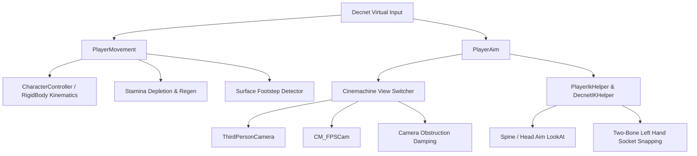

# Character Controller & Camera Engine

The AS1 Character Controller architecture decouples user input, kinematics simulation, visual camera presentation, and inverse kinematics (IK). This ensures tight, responsive shooter controls across desktop keyboard/mouse, console gamepads, and mobile touchscreens.

---

## Subsystem Architecture

---

## Chapter Overview

1. [Locomotion & Stamina]({{ site.baseurl }}/docs/character-controller/movement-and-locomotion/): Walk, sprint, jump physics, and stamina consumption curves.
2. [Seamless FPS / TPS Hybrid]({{ site.baseurl }}/docs/character-controller/camera-view-switcher/): Runtime 1-button view switching with Cinemachine priority blending.
3. [Cinemachine Obstacle Avoidance]({{ site.baseurl }}/docs/character-controller/cinemachine-obstacle-avoidance/): Raycast camera collision and smooth orbit recovery.
4. [Inverse Kinematics (IK) Rigging]({{ site.baseurl }}/docs/character-controller/ik-rigging/): Upper-body look-at orientation and two-bone weapon socket alignment.
