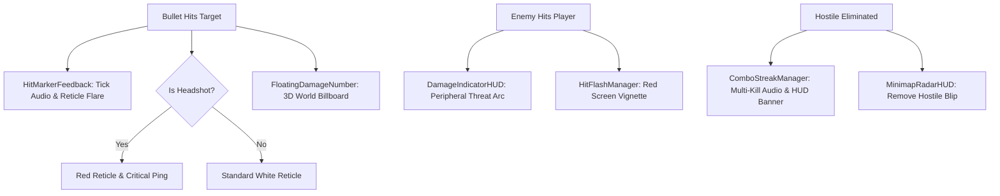

# Combat Feedback & UI Architecture

Tight combat feedback distinguishes satisfying shooters from sluggish ones. AS1 includes a comprehensive suite of sensory confirmation systems: reticle hit ticks, 3D floating damage numbers, directional threat arcs, streak banners, and real-time minimap radar.

---

## Feedback Loop

---

## Chapter Directory

1. [Hit Marker Feedback]({{ site.baseurl }}/docs/combat-feedback-and-ui/hit-markers/): Dynamic reticle bloom and hit sounds.
2. [Floating Damage Numbers]({{ site.baseurl }}/docs/combat-feedback-and-ui/floating-damage-numbers/): 3D billboarded floating damage indicators.
3. [Directional Damage Indicators]({{ site.baseurl }}/docs/combat-feedback-and-ui/directional-damage-indicator/): Threat arcs pointing toward attacker coordinates.
4. [Kill Streak & Combo Banners]({{ site.baseurl }}/docs/combat-feedback-and-ui/combo-streak-banner/): Multi-kill streaks and combo audio banners.
5. [Minimap & Radar System]({{ site.baseurl }}/docs/combat-feedback-and-ui/minimap-radar/): Dynamic 2D sweep tracking enemies and objectives.
6. [Contextual Prompts & Menus]({{ site.baseurl }}/docs/combat-feedback-and-ui/interact-prompts/): Interaction cues, pause menu, and game over screens.
