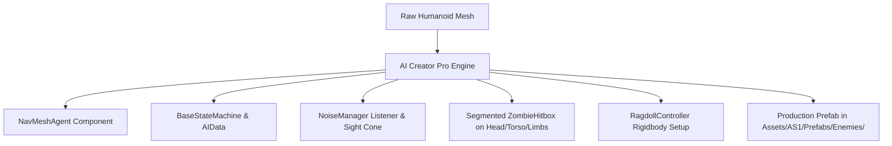

# AI Creator Pro

**AI Creator Pro** (`TabAICreatorPro.cs`) turns any raw humanoid FBX model into a fully-functional, pluggable FSM enemy with NavMesh navigation, sensory vision, hearing detection, weakpoint hitboxes, and dynamic ragdoll physics.

---

## Archetype Presets

| Archetype | Health | Patrol Speed | Chase Speed | Damage | Attack Cooldown | Sight Range | Sight FOV Cone | Special Ability |
| :--- | :--- | :--- | :--- | :--- | :--- | :--- | :--- | :--- |
| **Standard Walker** | 100 | 2.0 m/s | 5.5 m/s | 15 | 1.2s | 18m | 120? | Swarm aggression |
| **Fast Runner** | 60 | 3.5 m/s | 8.5 m/s | 10 | 0.8s | 24m | 140? | High agility, evasive zig-zag |
| **Heavy Tank** | 350 | 1.2 m/s | 3.8 m/s | 35 | 2.0s | 15m | 90? | Stagger resistance, heavy knockback |
| **Mutant Boss** | 1000 | 1.8 m/s | 6.0 m/s | 60 | 1.5s | 30m | 180? | Ground slam AoE, health bar HUD |

---

## Step-by-Step Workflow

1. Open `Tools > AS1 > Suite Hub` and select the **[AI] AI Creator Pro** tab.
2. Select an archetype preset to automatically populate balanced baseline attributes.
3. **Assign 3D Model**: Drag your humanoid model FBX or prefab into the **3D Model** field.
4. **Assign Animator Controller**: Select the Mecanim controller containing `Idle`, `Walk`, `Run`, `Attack`, and `Death` blend trees.
5. Configure health, speeds, attack range, and sight sensory parameters.
6. Assign audio clips for `Idle/Groan`, `Attack`, and `Death`.
7. Click **Generate Complete Zombie AI Prefab**.

---

## What AI Creator Pro Builds Under the Hood

> [!TIP]
> Head hitboxes automatically receive a **2.5x damage multiplier**, triggering the red headshot reticle marker and critical damage chime when shot by the player.
