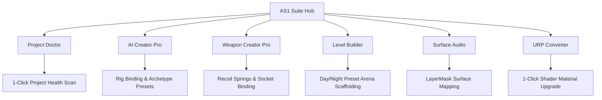

# AS1 Tool Suite Hub

The **AS1 Tool Suite** is a unified editor tooling engine built directly into Unity to streamline shooter game development. Instead of jumping between fragmented inspectors, custom scripts, and Project Settings, the Suite Hub consolidates validation, AI generation, weapon authoring, level scaffolding, and rendering pipeline conversion into a single tabbed interface.

Access the Suite Hub anytime from the Unity top menu:
```text
Tools > AS1 > Suite Hub
```


---

## Suite Hub Modules



### Module Directory:

1. [Welcome Wizard]({{ site.baseurl }}/docs/editor-suite/welcome-window/): Quick-launch onboarding modal and demo route shortcuts.
2. [Project Doctor]({{ site.baseurl }}/docs/editor-suite/project-doctor/): One-click diagnostic tool that automatically identifies and repairs missing layers, tags, input axes, and build settings.
3. [Weapon Creator Pro]({{ site.baseurl }}/docs/editor-suite/weapon-creator-pro/): Visual authoring tool with presets for Assault Rifles, Pistols, Shotguns, and Snipers.
4. [AI Creator Pro]({{ site.baseurl }}/docs/editor-suite/ai-creator-pro/): Converts any humanoid 3D model into an intelligent NavMesh zombie with weakpoint hitboxes in under 10 seconds.
5. [Level Scaffolder]({{ site.baseurl }}/docs/editor-suite/level-scaffolder/): Generates connected combat arenas with pre-wired lighting and spawn volumes.
6. [Surface Audio Manager]({{ site.baseurl }}/docs/editor-suite/surface-audio-manager/): Configures surface-specific footstep audio mapped across physics layers.
7. [URP Converter]({{ site.baseurl }}/docs/editor-suite/urp-converter/): Automated 1-click material migration tool for the Universal Render Pipeline.
