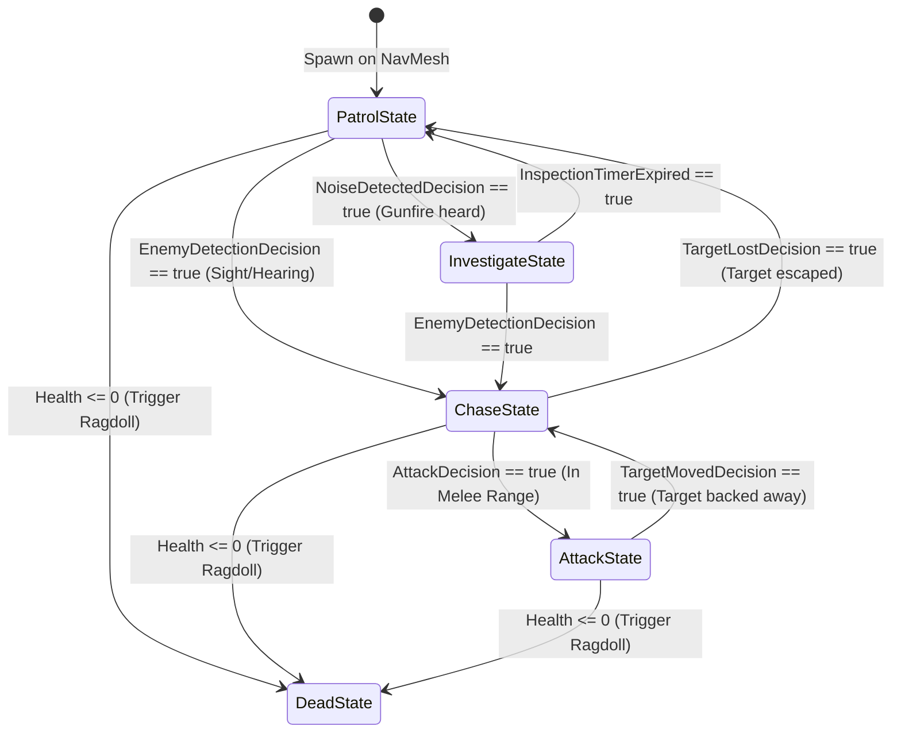

# Enemy AI & Pluggable FSM Architecture

AS1 incorporates an extensible, ScriptableObject-driven **Pluggable Finite State Machine (FSM)**. Instead of complex, memory-heavy behavior trees or hardcoded monolithic AI scripts, AS1 decouples logic into reusable **Actions**, **Decisions**, and **States**.

---

## FSM Architecture Diagram

---

## Chapter Directory

1. [FSM States & Transitions]({{ site.baseurl }}/docs/enemy-ai/fsm-states-and-transitions/): State lifecycle, transitions, and ScriptableObject architecture.
2. [Actions & Decisions Library]({{ site.baseurl }}/docs/enemy-ai/actions-and-decisions/): PatrolAction, ChaseAction, AttackAction, and detection decisions.
3. [Sensory Perception Engine]({{ site.baseurl }}/docs/enemy-ai/sensory-system/): Vision cone raycasting and auditory listening via `NoiseManager`.
4. [Hitboxes & Weakpoint Multipliers]({{ site.baseurl }}/docs/enemy-ai/hitboxes-and-multipliers/): Segmented collision on head, torso, and limbs.
5. [Dynamic Ragdoll Transition]({{ site.baseurl }}/docs/enemy-ai/ragdoll-physics/): Instantaneous kinematic-to-dynamic transition on lethal bullet impact.
6. [Zombie Spawner & Safe Zones]({{ site.baseurl }}/docs/enemy-ai/spawner-and-waves/): Wave progression, spawner volumes, and sanctuary safe zones.
7. [Enemy Archetypes & Variants]({{ site.baseurl }}/docs/enemy-ai/archetypes-and-bosses/): Standard Walkers, Fast Runners, Tanks, and `ExplosiveZombie` suicide bombers.
