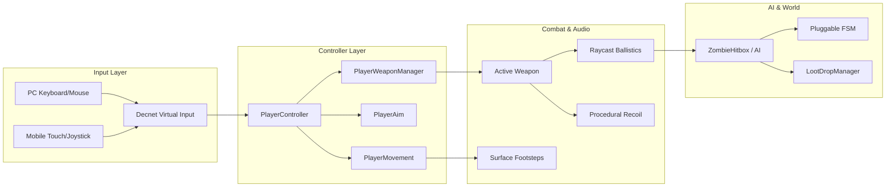

# Getting Started with AS1

Welcome to the **AS1 - Advanced Shooter System** documentation. This section covers system prerequisites, installation via the Unity Asset Store, onboarding setup, and a breakdown of the shipped package architecture.

---

## Architecture Overview

AS1 is structured around decoupled modular components communicating via standard Unity messages, events, and ScriptableObjects:

---

## Reading Guide

1. [Installation & Licensing]({{ site.baseurl }}/docs/getting-started/installation/): Important details on obtaining the package through the official Unity Asset Store, importing assets, and pipeline considerations.
2. [5-Minute Quick Start]({{ site.baseurl }}/docs/getting-started/quick-start/): Step-by-step guidance on running Sector 07 and confirming keyboard, mouse, and touch mechanics.
3. [Project Structure]({{ site.baseurl }}/docs/getting-started/project-structure/): Folder taxonomy of `Assets/AS1/` to help you locate prefabs, scripts, animations, and scenes.
