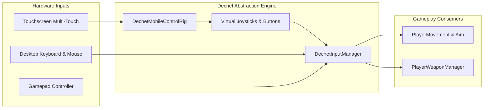

# Mobile Cross-Platform Input Architecture

AS1 is architected to run seamlessly on touch devices (Android, iOS) without requiring separate gameplay scripts. The `DecnetInput` framework abstracts input reading, allowing the player controller to query virtual axes regardless of input origin.

---

## Input Abstraction Flow

---

## Chapter Directory

1. [Custom Joystick Suite]({{ site.baseurl }}/docs/mobile-input/joysticks/): Fixed, Dynamic, Floating, and Variable joysticks.
2. [Touchpads & Action Buttons]({{ site.baseurl }}/docs/mobile-input/touchpads-and-buttons/): Screen look touchpads and action button handlers.
3. [Mobile Rig & Runtime Toggle]({{ site.baseurl }}/docs/mobile-input/mobile-rig-and-toggle/): 1-click runtime switching between PC and Mobile layouts.
