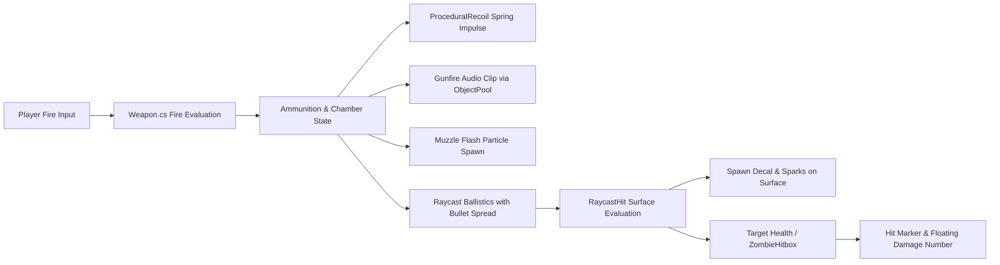

# Weapons & Ballistics Engine

The AS1 weapon system is designed around data-driven ScriptableObjects, physics-based procedural recoil, raycast ballistics with surface-aware decal placement, and seamless dual-slot weapon management.

---

## Ballistic Pipeline

---

## Chapter Directory

1. [WeaponData ScriptableObject]({{ site.baseurl }}/docs/weapons-and-ballistics/weapon-scriptable-object/): Data schema for damage, fire rates, spread, and audio banks.
2. [Raycast Ballistics & Decals]({{ site.baseurl }}/docs/weapons-and-ballistics/ballistics-raycasting/): Instantaneous raycasting, cone spread calculations, and surface impacts.
3. [Procedural Recoil Engine]({{ site.baseurl }}/docs/weapons-and-ballistics/procedural-recoil/): Spring-damper physics simulating 3D rotational and positional kick.
4. [Weapon Sway & Bobbing]({{ site.baseurl }}/docs/weapons-and-ballistics/weapon-sway/): Inertial mouse drag and movement displacement.
5. [Precision Optics & Scopes]({{ site.baseurl }}/docs/weapons-and-ballistics/sniper-scope/): 2D screen vignette overlays, FOV tweening, and sensitivity damping.
6. [Ammunition & Reloading]({{ site.baseurl }}/docs/weapons-and-ballistics/ammo-and-reload/): Tactical vs dry reloads, reserve pools, and supply pickups.
7. [Dual-Slot Weapon Switching]({{ site.baseurl }}/docs/weapons-and-ballistics/dual-weapon-switching/): Primary/secondary slots and holster animations.
8. [Quick Melee System]({{ site.baseurl }}/docs/weapons-and-ballistics/melee-combat/): Fast knife attack with spherecast hit detection.
9. [Explosive Frag Grenades]({{ site.baseurl }}/docs/weapons-and-ballistics/frag-grenades/): Physical projectile physics, bounce friction, fuse timer, and radial damage.
