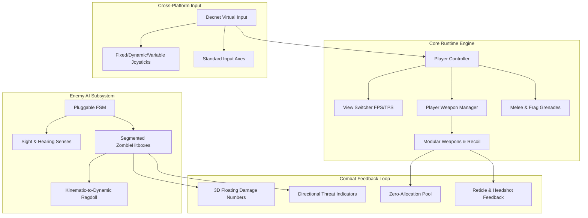

# AS1 ? Advanced Shooter System
{: .fs-9 }

Production-grade hybrid first-person and third-person shooter framework engineered for high-throughput mobile, desktop, and console titles.
{: .fs-6 .text-grey-dk-000 }

[Getting Started]({{ site.baseurl }}/docs/getting-started/){: .btn .btn-primary .fs-5 .mb-4 .mb-md-0 .mr-2 }
[Tool Suite Hub]({{ site.baseurl }}/docs/editor-suite/){: .btn .fs-5 .mb-4 .mb-md-0 .mr-2 }
[Public C# API]({{ site.baseurl }}/docs/api-reference/){: .btn .fs-5 .mb-4 .mb-md-0 }

---

## Architectural Philosophy: Pain vs. Solution

Building a responsive, production-ready shooter in Unity typically degenerates into spaghetti code: camera transitions stutter when colliding with level geometry, weapon recoil breaks procedural animations, AI agents drop frame rates with expensive raycasts, and mobile inputs require complete rewrites of player logic.

**AS1 solves these systemic bottlenecks through strict architectural decoupling:**

| Common Shooter Architecture Bottleneck | How AS1 Resolves It |
| :--- | :--- |
| **Rigid Camera Systems**: Switching between 1st and 3rd person breaks upper-body aim orientation and clips into level geometry. | **Decoupled View Blending**: Uses dual Cinemachine virtual cameras with procedural obstruction damping and synchronized spine look-at IK. |
| **Hard-coded Weapon Monoliths**: Ballistics, recoil, inventory, and audio bundled inside giant 3000-line scripts. | **Data-Driven Ballistics**: Modular `WeaponData` Scriptables separate weapon stats from physics simulation (`ProceduralRecoil`) and runtime state. |
| **Bloated AI Frameworks**: Heavy Behavior Trees or nav updates causing garbage collection spikes on mobile. | **Pluggable Finite State Machine**: Scriptable `BaseState`, decoupled sensory checks (`NoiseManager`, sight cones), and pooled ragdoll physics. |
| **Fragmented Platform Inputs**: Separate input loops for keyboard, gamepads, and touch devices. | **Unified Abstracted Input Pipeline**: Standalone and Mobile virtual rigs feed the identical controller interface with zero gameplay script branching. |

---

## Key Feature Matrix

### In-Engine Gameplay Preview

---

## What Is Included In AS1?

1. **Complete Sector 07 Proving Grounds**:
   - Ready-to-play showcase level featuring an interactive Armory, 10m/20m/35m Target Ranges, Live Zombie Combat Drill, and an Extraction Bunker progression loop.
   - Separate, fully calibrated Day (`TestingDemo.unity`) and Night (`TestingDemo_Night.unity`) scenes.

2. **AS1 Tool Suite**:
   - **Project Doctor**: 1-click diagnostic scanner that validates tags, physics layers, input axes, and build settings.
   - **Weapon Creator Pro**: Rapidly author firearms, auto-bind IK sockets, and generate pickup prefabs.
   - **AI Creator Pro**: Transform any humanoid 3D model into a fully-configured NavMesh combatant in seconds.
   - **Level Scaffolder**: Generate dual-environment starter maps with proper lighting environments.
   - **Surface Audio**: Surface-specific footstep audio mapped across configurable physics layers.
   - **URP Converter**: 1-click upgrade tool for Universal Render Pipeline materials.

3. **Production Gameplay Systems**:
   - Physical spring-damper recoil and lagged weapon sway.
   - Headshot weakpoint multipliers with audio-visual hit confirmation.
   - Kinetic physical frag grenades with bounce physics and explosive radial impulse.
   - Quick knife melee combat.
   - 2D real-time sweep radar and directional damage arcs.
   - Zero-allocation runtime object pool for bullets, shell casings, decals, and audio sources.

---

## Quick Navigation

- [Installation & Licensing]({{ site.baseurl }}/docs/getting-started/installation/) ? Unity version compatibility and package setup.
- [5-Minute Quick Start]({{ site.baseurl }}/docs/getting-started/quick-start/) ? Booting into Sector 07 and verifying controls.
- [AS1 Tool Suite]({{ site.baseurl }}/docs/editor-suite/) ? Complete manual for Project Doctor, Weapon Creator Pro, and AI Creator Pro.
- [Public C# API Reference]({{ site.baseurl }}/docs/api-reference/) ? In-depth method signatures and architectural patterns.
